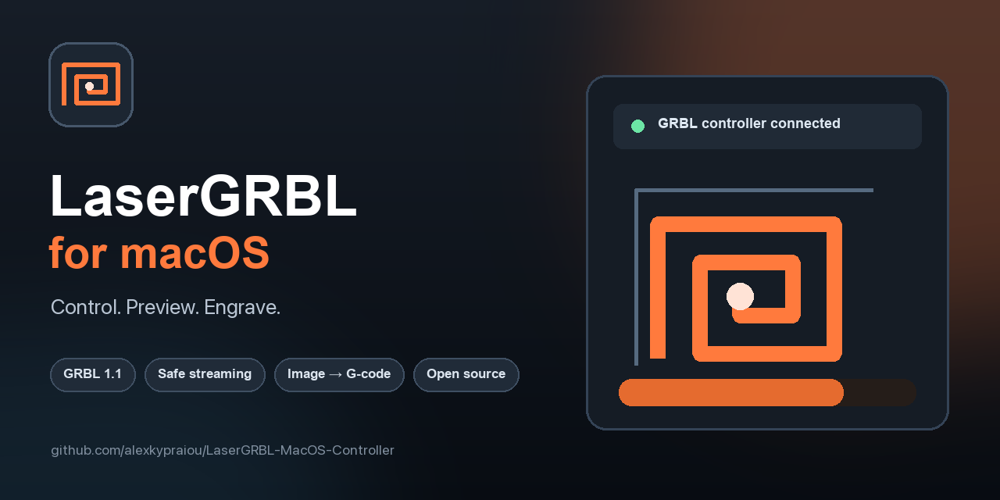
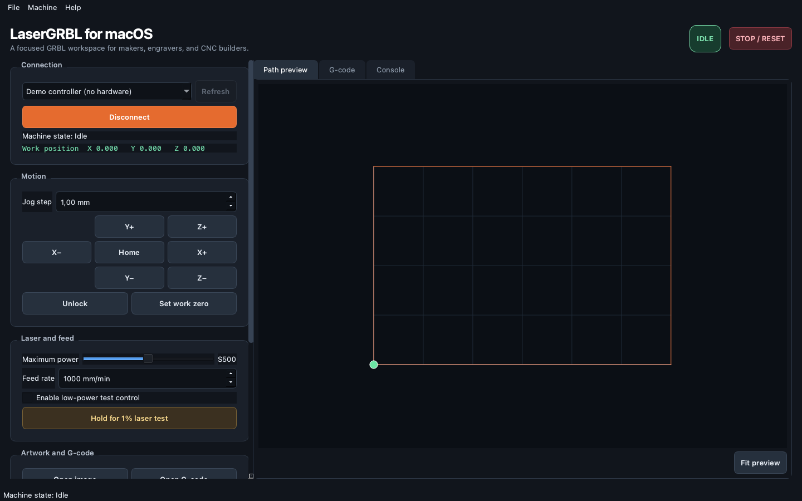

<p align="center">
  
</p>

<p align="center">
  <a href="https://github.com/alexkypraiou/LaserGRBL-MacOS-Controller/actions/workflows/ci.yml"></a>
  <a href="https://github.com/alexkypraiou/LaserGRBL-MacOS-Controller/actions/workflows/security.yml"></a>
  <a href="https://github.com/alexkypraiou/LaserGRBL-MacOS-Controller/releases"></a>
  <a href="LICENSE"></a>
  
  
</p>

<h1 align="center">LaserGRBL for macOS</h1>

<p align="center">
  A modern, open-source desktop controller for GRBL-compatible laser engravers and CNC machines.<br>
  Connect your machine, jog safely, preview toolpaths, generate raster G-code, and stream jobs with acknowledgement-based flow control.
</p>

> [!WARNING]
> Lasers can cause permanent eye injury, fire, and hazardous fumes. Use wavelength-rated eye protection, effective ventilation, a fire-resistant enclosure, and a physical emergency stop. Never leave a running machine unattended. Read the [Safety Guide](docs/SAFETY.md) before operating hardware.

## Why this project

Excellent GRBL tools exist, but many macOS makers still rely on Windows-only software or generic serial consoles. LaserGRBL for macOS provides a focused native desktop workflow without hiding the machine state or the G-code being sent.

The project is designed around three principles:

- **Visible:** machine state, work coordinates, console traffic, progress, and the path preview remain accessible.
- **Predictable:** one G-code line is streamed at a time and the next line waits for GRBL's `ok` acknowledgement.
- **Safety-minded:** laser testing is opt-in and hold-to-run; active jobs can be paused or aborted with GRBL real-time commands.

## Features

| Area | Included |
| --- | --- |
| Connection | Automatic serial-port discovery, GRBL detection, 115200 baud, reconnect-safe state |
| Motion | X/Y/Z jogging, configurable step and feed rate, homing, unlock, work-zero setup |
| Job control | Acknowledgement-driven streaming, progress and ETA, feed hold, resume, abort/reset |
| G-code | Open, edit, save, normalize, and preview `G0`/`G1` paths in metric or inch units |
| Artwork | Grayscale image conversion, threshold and resolution controls, serpentine raster scan |
| Laser | Dynamic-power `M4` output, configurable maximum power, guarded hold-to-test control |
| Diagnostics | Live GRBL console, parser-state request, machine status and work-position monitoring |
| Evaluation | Built-in `--demo` controller for exploring the complete interface without hardware |
| Delivery | Python package, automated tests, security scanning, and macOS `.app` release workflow |

## Interface

<p align="center">
  
</p>

The screenshot is captured from the built-in demo controller. No machine is required to explore the workspace.

## Quick start

### Download a macOS app

Tagged versions are built automatically by GitHub Actions. Download `LaserGRBL-for-macOS.zip` from the [latest release](https://github.com/alexkypraiou/LaserGRBL-MacOS-Controller/releases/latest), extract it, and move the app to `Applications`.

Current builds are ad-hoc signed, not notarized. If macOS blocks the first launch, Control-click the app, choose **Open**, and confirm that you want to run it.

### Run from source

Requirements:

- macOS 12 or newer recommended
- Python 3.11 or newer
- A GRBL 1.1-compatible controller for hardware operation

```bash
git clone https://github.com/alexkypraiou/LaserGRBL-MacOS-Controller.git
cd LaserGRBL-MacOS-Controller

python3 -m venv .venv
source .venv/bin/activate
python -m pip install --upgrade pip
python -m pip install -e .

lasergrbl-macos
```

The compatibility launcher also works after installation:

```bash
python LaserGRBLMacOS.py
```

### Explore without hardware

```bash
lasergrbl-macos --demo
```

Demo mode provides a simulated GRBL connection, movement updates, acknowledgements, and a sample calibration frame. It never opens a serial port.

## First job

1. Power the controller and connect it to the Mac over USB.
2. Select the serial device and click **Connect at 115200 baud**.
3. Confirm that the machine reaches `Idle`; unlock or home it if required by your GRBL configuration.
4. Open existing G-code, paste commands, or open an image and generate a raster job.
5. Inspect the path preview, dimensions, feed rate, and maximum power.
6. Prepare ventilation, eye protection, focus, material, and the physical emergency stop.
7. Click **Start job** and confirm the safety prompt.
8. Use **Pause** for GRBL feed hold or **Abort** for feed hold plus soft reset.

For image engraving, configure GRBL laser mode before running a generated job:

```gcode
$32=1
```

Generated raster jobs use `M4` dynamic laser power, metric coordinates, absolute positioning, and a bidirectional scan. Always test a small sample at low power first.

## Supported G-code preview

The path preview understands:

- `G0` and `G1` modal motion
- `G20` and `G21` units
- `G90` and `G91` positioning
- `M3`, `M4`, `M5`, and `S` laser state
- Inline `(...)` and `;` comments

Arc interpolation (`G2`/`G3`), canned cycles, and controller-specific macros are streamed unchanged but are not currently drawn in the preview. Review those programs in a dedicated simulator before running them.

## Project structure

```text
src/lasergrbl_macos/
├── app.py          # PyQt6 interface, serial connection, and job orchestration
├── gcode.py        # Raster generation and motion-path parsing
├── grbl.py         # Status parser, line framing, and safe stream state machine
└── __main__.py     # Command-line entry point and demo-mode flag

tests/              # Hardware-independent protocol and G-code tests
packaging/          # PyInstaller macOS application bundle
scripts/            # Promotional assets, screenshot, and icon generation
docs/               # Safety, troubleshooting, promotion, and release guides
```

## Development

```bash
python3 -m venv .venv
source .venv/bin/activate
python -m pip install -e ".[dev]"

ruff format --check .
ruff check .
pytest
```

Run the interface against the simulator while developing:

```bash
lasergrbl-macos --demo
```

See [CONTRIBUTING.md](CONTRIBUTING.md) for the full workflow and [ROADMAP.md](ROADMAP.md) for planned milestones.

## Build the `.app`

On macOS, install the build tools and run:

```bash
python -m pip install -e ".[build]"
python scripts/generate_assets.py
bash scripts/create_icns.sh
pyinstaller --noconfirm packaging/LaserGRBL-MacOS.spec
```

The resulting bundle is written to `dist/LaserGRBL for macOS.app`. Release builds are automated by `.github/workflows/release.yml` when a `v*` tag is pushed.

## Contributing

Issues and pull requests are welcome. Useful contributions include additional controller testing, arc previews, vector import, localization groundwork, packaging improvements, and documentation for real machine configurations.

- Review the [contribution guide](CONTRIBUTING.md).
- Search existing [issues](https://github.com/alexkypraiou/LaserGRBL-MacOS-Controller/issues) before opening a new one.
- Use demo mode when a change does not require physical hardware.
- Never test laser behavior without appropriate safety systems.

## Status and scope

This project is in **alpha**. It should be tested carefully with your specific controller, firmware, wiring, and machine limits before production use. It is an independent community project and is not affiliated with or endorsed by the original Windows LaserGRBL project.

## License

Released under the [MIT License](LICENSE).

## Acknowledgements

- [GRBL](https://github.com/gnea/grbl) for the open machine-control firmware and protocol.
- [LaserGRBL](https://github.com/arkypita/LaserGRBL) for demonstrating how accessible laser control software can support the maker community.
- The open-source PyQt and Pillow communities.
